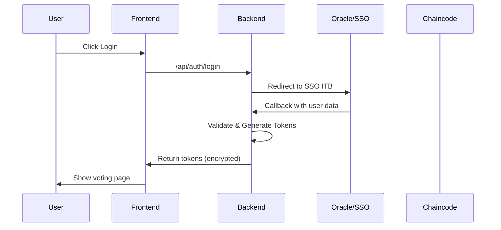
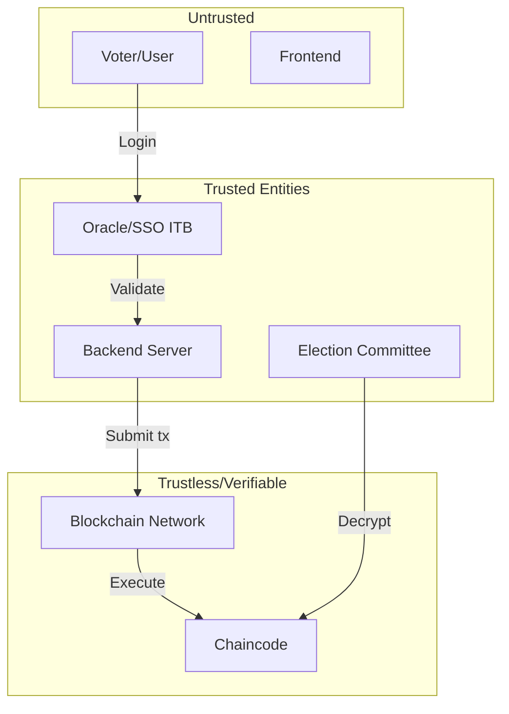
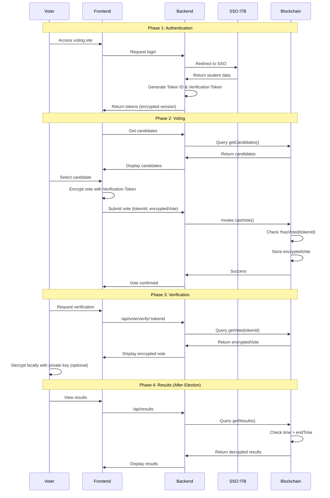

# Blockchain Voting Application - Implementation Plan

## Overview

Aplikasi voting berbasis blockchain untuk pemilihan mahasiswa ITB menggunakan Hyperledger Fabric sebagai platform blockchain, dengan validasi pemilih melalui Oracle SSO ITB.

---

## Repository Structure Decision: Monorepo

### Alasan Pemilihan Monorepo

| Aspek                    | Monorepo                          | Multi-repo                        |
| ------------------------ | --------------------------------- | --------------------------------- |
| **Shared Types**         | ✅ Mudah berbagi TypeScript types | ❌ Perlu publish npm package      |
| **Versioning**           | ✅ Satu version untuk semua       | ❌ Kompleks dependency management |
| **CI/CD**                | ✅ Satu pipeline terintegrasi     | ❌ Multiple pipelines             |
| **Refactoring**          | ✅ Atomic changes across packages | ❌ Multi-repo PRs                 |
| **Developer Experience** | ✅ Single clone, single install   | ❌ Multiple repos to manage       |

**Kesimpulan**: Monorepo lebih cocok karena:

1. Chaincode, backend, dan frontend berbagi types (Candidate, Vote, Election)
2. Tim development kecil (proyek akademik)
3. Deployment koordinasi lebih mudah

---

## Repository Structure

```
voting-blockchain/
├── frontend/                     # Next.js Application
│   ├── src/
│   │   ├── app/                  # App Router
│   │   │   ├── (auth)/
│   │   │   │   ├── login/
│   │   │   │   └── callback/     # SSO callback
│   │   │   ├── vote/
│   │   │   │   ├── page.tsx      # Voting page
│   │   │   │   └── verify/       # Vote verification
│   │   │   ├── results/          # Results (post-election)
│   │   │   └── layout.tsx
│   │   ├── components/
│   │   │   ├── ui/               # Shadcn components
│   │   │   ├── VoteCard.tsx
│   │   │   ├── CandidateList.tsx
│   │   │   └── VerificationResult.tsx
│   │   ├── lib/
│   │   │   ├── api.ts            # API client
│   │   │   └── encryption.ts     # Client-side encryption
│   │   └── types/
│   ├── package.json
│   └── tsconfig.json
│
├── backend/                      # Hono.js API Server
│   ├── src/
│   │   ├── index.ts              # Entry point
│   │   ├── routes/
│   │   │   ├── auth.ts           # SSO authentication
│   │   │   ├── vote.ts           # Voting endpoints
│   │   │   ├── election.ts       # Election management
│   │   │   └── verify.ts         # Vote verification
│   │   ├── services/
│   │   │   ├── oracle.ts         # SSO ITB Oracle
│   │   │   ├── fabric.ts         # Fabric Gateway client
│   │   │   └── token.ts          # Token generation
│   │   ├── middleware/
│   │   │   ├── auth.ts           # JWT validation
│   │   │   └── rateLimit.ts
│   │   └── lib/
│   │       ├── crypto.ts         # Encryption utilities
│   │       └── fabric-connection.ts
│   ├── package.json
│   └── tsconfig.json
│
├── chaincode/                    # Hyperledger Fabric Chaincode
│   ├── src/
│   │   ├── index.ts              # Contract entry
│   │   ├── contracts/
│   │   │   └── votingContract.ts # Main voting contract
│   │   ├── models/
│   │   │   ├── candidate.ts
│   │   │   ├── election.ts
│   │   │   └── vote.ts
│   │   └── utils/
│   │       └── validation.ts
│   ├── package.json
│   └── tsconfig.json
│
├── oracle/                       # SSO ITB Oracle Service
│   ├── src/
│   │   ├── index.ts
│   │   ├── sso.ts                # SSO ITB client
│   │   └── validator.ts          # Student validation
│   ├── package.json
│   └── tsconfig.json
│
├── shared/                       # Shared TypeScript Types
│   ├── src/
│   │   ├── types/
│   │   │   ├── candidate.ts
│   │   │   ├── election.ts
│   │   │   ├── vote.ts
│   │   │   └── token.ts
│   │   └── index.ts
│   ├── package.json
│   └── tsconfig.json
│
├── network/                      # Hyperledger Fabric Network
│   ├── docker/
│   │   ├── docker-compose.yml    # Fabric network
│   │   └── docker-compose.explorer.yml
│   ├── organizations/
│   │   ├── ordererOrganizations/
│   │   └── peerOrganizations/
│   │       ├── itb.ac.id/        # ITB organization
│   │       └── kpu.itb.ac.id/    # KPU organization
│   ├── channel-artifacts/
│   ├── configtx/
│   │   └── configtx.yaml
│   └── scripts/
│       ├── network.sh            # Network management
│       ├── createChannel.sh
│       └── deployCC.sh           # Deploy chaincode
│
├── package.json                  # Root package.json
├── pnpm-workspace.yaml
└── README.md
```

---

## Component Descriptions

### 1. Frontend (Next.js + TypeScript)

**Fungsi utama:**

-   Halaman login dengan redirect ke SSO ITB
-   Halaman voting dengan daftar kandidat
-   Halaman verifikasi suara
-   Halaman hasil (hanya aktif setelah pemilihan berakhir)

**Key Features:**

-   Server-side rendering untuk SEO
-   Client-side encryption sebelum mengirim vote
-   Real-time status pemilihan

---

### 2. Backend (Hono.js + TypeScript)

**Fungsi utama:**

-   Proxy antara frontend dan Fabric network
-   Integrasi dengan Oracle SSO ITB
-   Token management (generation & validation)
-   Transaction signing ke Fabric

**Endpoints:**

| Method | Endpoint                    | Description                 |
| ------ | --------------------------- | --------------------------- |
| GET    | `/api/auth/login`           | Redirect ke SSO ITB         |
| GET    | `/api/auth/callback`        | Handle SSO callback         |
| POST   | `/api/auth/token`           | Generate voting tokens      |
| GET    | `/api/election/status`      | Get election status         |
| GET    | `/api/election/candidates`  | Get candidate list          |
| POST   | `/api/vote/submit`          | Submit encrypted vote       |
| GET    | `/api/vote/verify/:tokenId` | Verify vote on ledger       |
| GET    | `/api/results`              | Get results (post-election) |

---

### 3. Chaincode (Hyperledger Fabric)

**Smart Contract Functions:**

```typescript
// Setup & Admin
initElection(candidates[], startTime, endTime)
addCandidate(candidateId, name, vision)
updateElectionTime(startTime, endTime)

// Voting
castVote(tokenIdentifier, encryptedVote)
hasVoted(tokenIdentifier): boolean

// Query
getElectionStatus(): ElectionStatus
getCandidates(): Candidate[]
getResults(): Results  // Only after endTime
getVote(tokenIdentifier): EncryptedVote
```

---

### 4. Oracle Service (SSO ITB Integration)

**Fungsi:**

-   Validate student identity via SSO ITB
-   Verify eligibility (active student, not graduated)
-   Generate cryptographic tokens

**Flow:**



---

## Token System Design

### Token Identifier

-   **Purpose**: Unique transaction ID for voting
-   **Generation**: `HMAC-SHA256(studentNIM + electionId + secret)`
-   **Properties**:
    -   Deterministic (same student = same token per election)
    -   Cannot reveal student identity
    -   Used as ledger key

### Token Verifikasi Suara

-   **Purpose**: Encrypt vote data
-   **Type**: RSA-2048 public key (asymmetric)
-   **Usage**:
    -   Public key given to voter
    -   Private key held by Election Committee
    -   Decryption only after election ends

---

## Security & Privacy Model

### Data Privacy

| Data             | Storage Location    | Encryption         |
| ---------------- | ------------------- | ------------------ |
| Student NIM      | Never stored        | N/A                |
| Token Identifier | Backend (temporary) | Hashed             |
| Vote Choice      | Blockchain          | RSA-2048 encrypted |
| Candidate Info   | Blockchain          | Plaintext          |

### Trust Model



**Trust Assumptions:**

1. **Oracle (SSO ITB)**: Trusted untuk validasi identitas mahasiswa
2. **Backend**: Trusted untuk tidak menyimpan korelasi NIM-Token
3. **Blockchain**: Trustless - semua dapat memverifikasi
4. **Election Committee**: Trusted untuk menjaga private key

### Hyperledger Fabric Security Features

1. **Channel Isolation**: Voting channel terpisah dari data lain
2. **Private Data Collections**: Untuk data sensitif jika diperlukan
3. **Endorsement Policy**: Minimal 2 org harus endorse transaksi
4. **Access Control**: Chaincode-level ACL

---

## End-to-End Voting Flow



---

## Critical Review & Risk Analysis

### 1. Ketergantungan pada Oracle

**Risiko:**

-   Single point of failure
-   SSO ITB adalah external service diluar kontrol
-   Tidak ada fallback mechanism

**Mitigasi:**

-   Implement caching untuk session yang sudah tervalidasi
-   Retry mechanism dengan exponential backoff
-   Monitoring dan alerting untuk SSO availability

---

### 2. Penggunaan Token untuk Enkripsi

**Risiko:**

-   Key management complexity
-   Jika private key bocor, semua suara dapat dibaca
-   Token Identifier yang deterministik bisa di-brute force jika algorithm diketahui

**Mitigasi:**

-   Use HSM (Hardware Security Module) untuk private key storage
-   Multi-party computation untuk dekripsi
-   Salt yang random dan panjang untuk token generation

---

### 3. Trade-off: Privasi vs Verifiability

**Konflik:**

-   Voter ingin memverifikasi suaranya tercatat
-   Tapi suara harus rahasia dari pihak lain

**Solusi yang Diimplementasikan:**

-   Voter bisa melihat encrypted vote mereka
-   Hanya voter yang punya token yang bisa decrypt
-   Tapi ini berarti voter bisa membuktikan pilihannya ke orang lain (coercion risk)

**Alternatif yang Bisa Dipertimbangkan:**

-   Zero-knowledge proofs (kompleks untuk implementasi)
-   Homomorphic encryption (sangat kompleks)

---

### 4. Keterbatasan Hyperledger Fabric vs Public Blockchain

| Aspek            | Hyperledger Fabric         | Public Blockchain   |
| ---------------- | -------------------------- | ------------------- |
| **Trust**        | Permissioned, centralized  | Trustless           |
| **Transparency** | Terbatas pada participants | Fully public        |
| **Performance**  | Tinggi (1000+ TPS)         | Rendah (10-100 TPS) |
| **Cost**         | Rendah (no gas)            | Tinggi (gas fees)   |
| **Finality**     | Immediate                  | Probabilistic       |

**Implikasi:**

-   Trust bergantung pada legitimasi organisasi yang menjalankan network
-   Tidak se-transparent public blockchain
-   Namun lebih praktis untuk kasus pemilihan kampus

---

### 5. Risiko Tambahan

1. **Insider Threat**: Admin backend bisa log korelasi NIM-Token

    - Mitigasi: Audit logging, separation of duties

2. **Timing Attack**: Waktu transaksi bisa mengkorelasikan dengan waktu login SSO

    - Mitigasi: Batch processing, random delays

3. **Chaincode Bugs**: Smart contract immutable, bug bisa fatal
    - Mitigasi: Extensive testing, formal verification jika memungkinkan

---

### Rekomendasi Perbaikan Desain

1. **Implement Threshold Cryptography**: Butuh N dari M key holders untuk decrypt
2. **Add Audit Trail**: Log semua akses dengan hash chain
3. **Implement Vote Mixing**: Shuffle votes sebelum di-commit
4. **Add Time-lock Encryption**: Dekripsi otomatis setelah waktu tertentu
5. **Consider Zero-Knowledge Proofs**: Untuk long-term improvement
